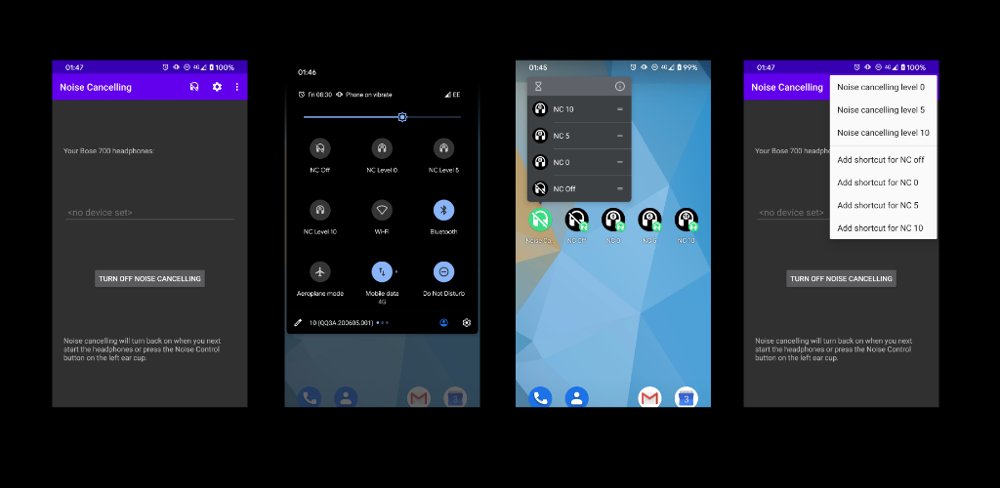

# Noise Cancelling Switch

_Quickly turn off noise cancellation on *Bose Noise Cancelling Headphones 700* and *Bose QC 35* headphones_

## What?

This Android app allows you to quickly turn off noise cancellation on *Bose Noise Cancelling Headphones 700* (NC 700) and *Bose QC 35* (QC35) headphones.

The app also allows a (less-useful) change of mode on *Bose QC Earbuds* and *Bose QC 45* headphones -- it is not able to fully disable active noise cancellation.

## Why?

*Bose Noise Cancelling Headphones 700* have a "noise control" button to cycle through noise cancellation presets, but these are on a scale (three presets between 0-10) from actively passing external sound through, to cancelling out external sound.  In a very quiet room, any setting on this scale can result in an audible hiss, and you may not want any active pass-through/cancelling at all, but just the sound.  The official _Bose Music_ app does allow you to temporarily turn off noise cancelling, but this setting is buried in the app and takes some time to get to.

## When?

You can:

* turn off noise cancellation through this app, or
* add as a quick settings _tile_ to turn off with as single touch, or
* add a single touch shortcut you can pin to your launcher.

Noise cancelling will turn back on if you alter the noise control settings on the headphones, or when you next turn the headphones on. 

## How?

The application sends a short message (repeated 3 times) over the device's Serial Port Profile (SPP) connection. 

### How: NC700

The cancellation levels are fully supported on the NC700: "off", "0", "5" and "10" .

To change noise cancellation level on the NC700, where `enabled` is `0`=off, `1`=on; and, if enabled, `level` is `0`-`10` (the level is inverted in the packet to: `10 - level`):

> Send: 0x01 0x05 0x02 0x02 (10-level) (enabled)
> Response: 0x01 0x05 0x03 0x03 0x0b (10-level) (enabled)

When toggling enabled `off` to `on`, device returns to default level regardless of the level sent, so a second repeat packet is required to resume to a level other than 10.

### How: QC35

The cancellation levels are partly supported on the QC35: "off" (off), "0" (low), "5" (sends "medium" as below but no effect on QC35) and "10" (high).

To change noise cancellation level on the QC35, where `mode` is `0`=off, `1`=high, (`2`=medium?), `3`=low:

> Send: 0x01 0x06 0x02 0x01 (mode)
> Response: 0x01 0x06 0x03 0x02 (mode) 0x0b

The *medium* mode does not appear to do anything on the *QC35* -- perhaps it does something on the *QC35ii*?

### How: QC Earbuds

The cancellation levels are approximated by switching modes on the QC Earbuds: "off" (second custom mode), "0" (Aware), "5" (first custom mode) and "10" (Quiet).

To change the noise cancellation mode on the QC Earbuds, where `mode` is `0`=Quiet (full NC), `1`=Aware (pass-through with optional *ActiveSense* adjustment for loud noises), `2`=first user-supplied custom mode, `3`=second user-supplied custom mode.

> Send: 0x1f 0x03 0x05 0x02 (mode) 0x01
> Response: 0x1f 0x03 0x07 0x00
> Response: 0x1f 0x03 0x06 0x01 (mode)

### How: QC45

The cancellation levels are approximated by switching modes on the QC45: "off" (Aware), "0" (Aware), "5" (unknown mode where the device says "Quiet" but doesn't appear to change mode?) and "10" (Quiet).

To change the noise cancellation mode on the QC45, where `mode` is `0`=Quiet (full NC), `1`=Aware (pass-through):

> Send: 0x1f 0x03 0x05 0x02 (mode) 0x01
> Response: 0x1f 0x03 0x07 0x00
> Response: 0x1f 0x03 0x06 0x01 (mode)

QC45 does not support custom modes, but sending `mode=2` ("first user-supplied custom mode" on the earbuds) causes the device to say "quiet" but seemingly not change mode?

## Disclaimer

> This product is provided 'AS IS', the developer makes no warranties, accepts no liability, and hereby disclaims any implied warranties, including any warranty of merchantability and warranty of fitness for a particular purpose. This software sends a specific message to the device you choose.  This has only been tested on one pair of headphones of a single firmware version.  You accept liability for whatever happens, including any damage, injury, or loss.

## See also

* [App Website](https://noisecancel.danjackson.dev)
* [Google Play Store Listing](https://play.google.com/store/apps/details?id=dev.danjackson.noisecancel)
* [Install directly from APK](https://github.com/danielgjackson/noisecancel/releases)
<!-- * [Open Source Code Repository](https://github.com/danielgjackson/noisecancel/) ([license](https://github.com/danielgjackson/noisecancel/blob/master/LICENSE)) -->
<!-- * [Privacy Policy](https://noisecancel.danjackson.dev/privacy.html) -->

<!--

## Android Bluetooth Logs

* Enable developer mode: *Settings*, *About Phone*, *Software Information*, repeatedly tap *Build Number*
* Enable USB debugging: *Settings*, *Developer Options*, *USB Debugging*.
* Enable Bluetooth log: *Settings*, *Developer Options*, *Enable Bluetooth HCI snoop log*, *Enabled*.
* Disable then re-enable Bluetooth on the device
* Download Android Debug Bridge `adb`
* Download the [Android Platform Tools](https://developer.android.com/studio/releases/platform-tools.html) and ensure Android Debug Bridge `adb` command is in your `PATH` environment variable.
* Connect device to computer, on device: authorize computer for debugging, run `adb devices` to check that the device is attached.
* Create local bug report: `adb bugreport` -- generates locally-timestamped `bugreport-*-YYYY-MM-DD-hh-mm-ss.zip` (disable Bluetooth)
* Extract `FS/data/log/bt/btsnoop_hci.log` or `FS/data/misc/bluetooth/logs/btsnoop_hci.log` from the `.zip` file
* Disable Bluetooth log: *Settings*, *Developer Options*, *Enable Bluetooth HCI snoop log*, *Disabled*.
* Disable then re-enable Bluetooth on the device
* Use [Wireshark](https://www.wireshark.org/download.html) to examine `btsnoop_hci.log`:
  * *View*, *Time Display Format*, *Time of Day*
  * Where *Protocol* is *SPP*

-->
